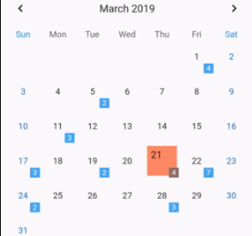
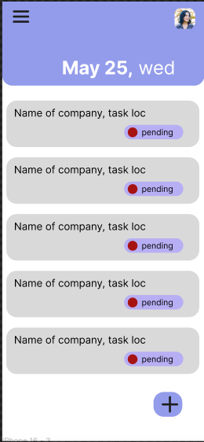
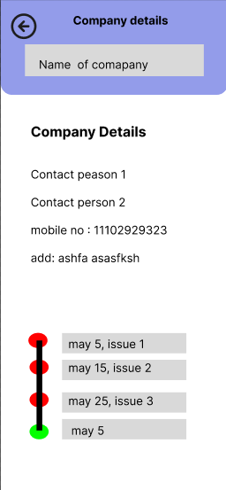
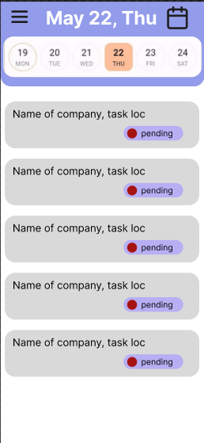

The application is designed for a company that manages both shipments and the routine maintenance of various machinery. Its primary goal is to streamline customer data, manage maintenance scheduling based on predefined periods (e.g., 2-month, 6-month cycles), and provide an intuitive view of upcoming maintenance tasks. The app will be built with flutter for cross-platform mobile development, SQLite for local storage, and Firebase for remote data synchronization.
2. Core Functional Requirements
A. Customer Management

    New Customer Entry:

        Fields:

            Customer Name

            Contact Person (Owner)

            Contact Person 2 (Production Manager)

            Contact Person 3 (Technical Manager)

            Address 1

            Pin Code

            City

            State

            Phone No

            Mobile

            Email Id

            location_cords

            checkup_interval, (2 day, 1 week, 2 week, 1 month)

        UI Features:

            Use dropdown menus where applicable (e.g., State, City, or predefined customer types) to ensure data consistency.

            Validation checks (e.g., valid email format, phone number constraints, and required fields).

            An option to edit or delete existing customer information.

B. Maintenance Scheduling

    Automated Scheduling:

        Trigger: When a new customer or machinery entry is added, automatically calculate upcoming maintenance dates based on the selected intervals (e.g., 2-month or 6-month scheduling).

        Logic:

            Store the installation or last maintenance date as the baseline.

            Compute the next maintenance date by adding the interval (2 or 6 months).

            Option to override or edit scheduled dates manually.

        Data Model:

            Maintenance records linked to customer and machinery entries.

            Status tracking (upcoming, completed, overdue).

C. Calendar and Agenda View

    Visual Interface:

        Implement a table_calendar 3.2.0 widget in flutter, 

        Features:

            Display maintenance schedules, with color-coding or labels to distinguish types of maintenance (2-month, 6-month).

            Allow users to tap on a date to see detailed information (customer details, machinery ID, maintenance instructions).

            Option for week, month, or list views to accommodate user preferences.

D. Data Management

    Local Storage (SQLite):

        Schema design for:

            Customer Table (detailed fields for each customer).

            Maintenance Table (including scheduled dates, status, and links to customer records).

            Shipments Table (as needed, based on company requirements).

        Offline capability to allow full functionality without a constant internet connection.

these are my UI pages

use these UI images as a reference to design the pages, for my app
there will be 5 pages (Upcoming, Details) accessible through the Menu
the home page displays list of appointments/jobs due for that day. and onClick of any job redirect to Maps page, that contains a bottom-sheet accessible  by clicking on the Company Name & Address displayed at the top

the calender picker in Upcoming page, allows user to select dates. (number of events present are also displayed using numbers, just shown in calender image)
the detains page displays all the details for selected company, with Company name as dropdown( contains list of company names in database) # yasui_app
